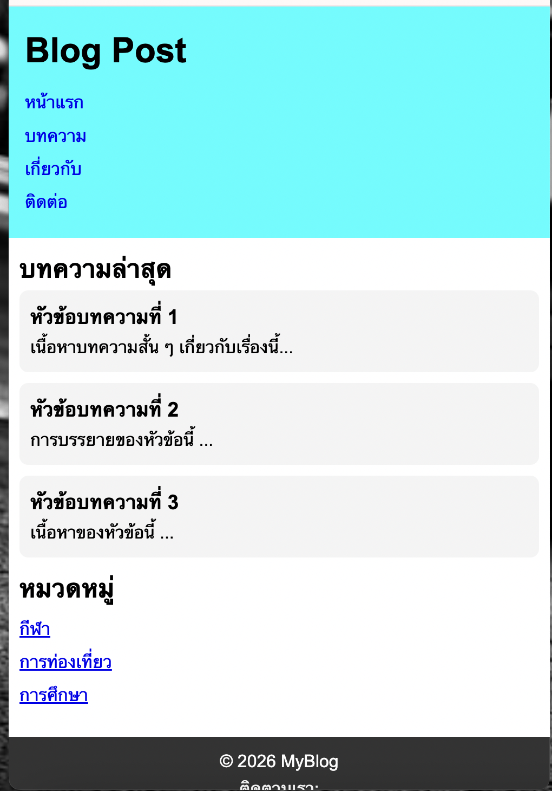
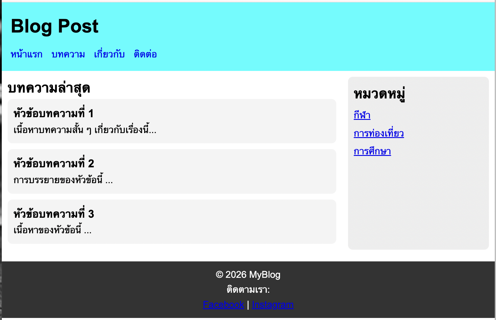
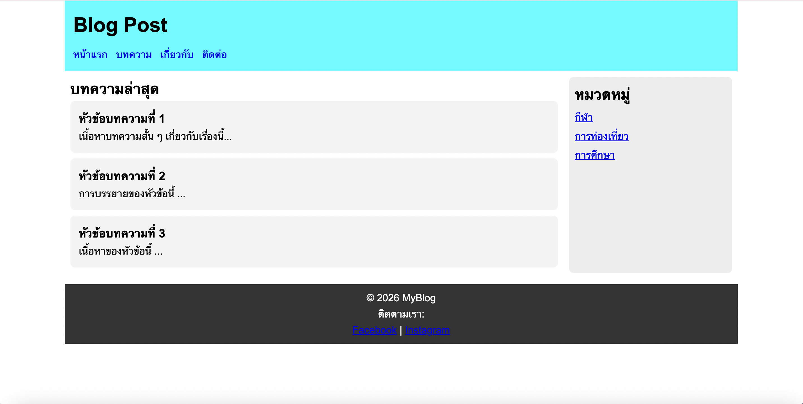

# ข้อที่ 3 Responsive Design และ CSS

## อธิบายหลักการ Mobile-First Approach ในการออกแบบเว็บไซต์ รวมถึงการใช้ Media Queries ยกตัวอย่าง CSS code ที่แสดงวิธีการปรับการแสดงผลสำหรับ mobile (320px), tablet(768px), และ desktop (1024px) เพื่อให้เว็บไซต์สามารถแสดงผลได้ดีบนอุปกรณ์ต่างๆ

**ตอบ**

Mobile-First Approach คือ แนวคิดการออกแบบ website โดย เริ่มจากออกแบบจอเล็กคือ มือถือก่อน แล้วค่อยขยายไปยังหน้าจอที่ใหญ่ขึ้น (tablet , desktop)

Media Queries คือ คำสั่งใน CSS ที่ใช้กำหนด style ตามขนาดหน้าจอ

**ตัวอย่างโค้ด**

```
/*  Mobile (ค่าเริ่มต้น) */
body {
  font-size: 14px;
}

.container {
  display: flex;
  flex-direction: column;
}

/* 🔹 Tablet (768px ขึ้นไป) */
@media (min-width: 768px) {
  body {
    font-size: 16px;
  }

  .container {
    flex-direction: row;
  }
}

/* 🔹 Desktop (1024px ขึ้นไป) */
@media (min-width: 1024px) {
  body {
    font-size: 18px;
  }

  .container {
    max-width: 1200px;
    margin: auto;
  }
}
```

**โค้ดที่ใช้ ยกตัวอย่างจากข้อ 2**

```
/* Layout (Mobile First) */
.container {
  display: flex;
  flex-direction: column;
  padding: 10px;
}

.main {
  width: 100%;
}

.post {
  background: #f4f4f4;
  margin-bottom: 10px;
  padding: 10px;
  border-radius: 8px;
}

.category-list {
  list-style: none;
}

.category-list li {
  margin: 5px 0;
}

/*  Footer */
.footer {
  background: #333;
  color: white;
  text-align: center;
  padding: 10px;
  margin-top: 10px;
}

/*  Tablet (768px ขึ้นไป) */
@media (min-width: 768px) {
  .container {
    flex-direction: row;
    gap: 20px;
  }

  .main {
    width: 70%;
  }

  .sidebar {
    display: block;
    width: 30%;
    background: #eee;
    padding: 10px;
    border-radius: 8px;
  }

  .nav-list {
    display: flex;
    gap: 15px;
  }

  .nav-list li {
    margin: 0;
  }
}

/*  Desktop (1024px ขึ้นไป) */
@media (min-width: 1024px) {
  body {
    max-width: 1200px;
    margin: 0 auto;
    font-size: 18px;
  }

  .main {
    width: 75%;
  }

  .sidebar {
    width: 25%;
  }

  .post {
    padding: 15px;
  }
}

```




