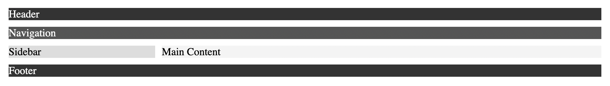

# ข้อที่ 4 Flexbox และ Grid Layout

## เปรียบเทียบความแตกต่างระหว่าง CSS Flexbox และ CSS Grid พร้อมยกตัวอย่าง use cases ที่เหมาะสมสำหรับการใช้งานแต่ละเทคนิค (เช่น Flexbox เหมาะสำหรับ navigation bar,Grid เหมาะสำหรับ page layout)

**ตอบ**

**ความแตกต่างระหว่าง CSS Flexbox และ CSS Grid**

1. ด้านมิติของการจัด layout

   flexbox -> จัดแบบ 1 มิติ (rows or column)

   Grid -> จัดแบบ 2 มิติ (rows or column)

2. ลักษณะการใช้งาน

   Flexbox -> ใช้จัดเรียง element ต่อกันเป็นแนวเดียว เช่น ซ้ายไปขวา

   Grid -> ใช้จัด layout เป็น “ช่อง ๆ” คล้ายตาราง

3. ความเหมาะสม

   Flexbox -> เหมาะกับ Navigation bar , ปุ่มเรียงกัน , จัดกึ่งกลาง , layout ง่ายๆ

   Grid -> โครงสร้างหน้าเว็บ (header / sidebar / content / footer) , dashboard , gallery , layout ซัยซ้อน

ตัวอย่าง โค้ด ของการใช้ flexbox ใน html , css

`HTML`

```
<nav class="navbar">
  <div class="logo">MyBlog</div>

  <ul class="menu">
    <li><a href="#">หน้าแรก</a></li>
    <li><a href="#">บทความ</a></li>
    <li><a href="#">เกี่ยวกับ</a></li>
    <li><a href="#">ติดต่อ</a></li>
  </ul>
</nav>
```

`CSS`

```
.navbar {
  display: flex;
  justify-content: space-between; /* โลโก้ซ้าย เมนูขวา */
  align-items: center;
  padding: 10px;
  background: #333;
}

.logo {
  color: white;
  font-weight: bold;
}

.menu {
  display: flex; /* เรียงเมนูแนวนอน */
  list-style: none;
  gap: 15px;
}

.menu a {
  color: white;
  text-decoration: none;
}
```

ตัวอย่าง โค้ด ของการใช้ css grid ใน html , css

`HTML`

```
<!doctype html>
<html lang="en">
  <head>
    <meta charset="UTF-8" />
    <meta name="viewport" content="width=device-width, initial-scale=1.0" />
    <title>Document</title>
    <link rel="stylesheet" href="style.css" />
  </head>
  <body>
    <div class="container">
      <header class="header">Header</header>

      <nav class="nav">Navigation</nav>

      <main class="main">Main Content</main>

      <aside class="sidebar">Sidebar</aside>

      <footer class="footer">Footer</footer>
    </div>
  </body>
</html>
```


`CSS`

```
.container {
  display: grid;

  /* กำหนด 2 คอลัมน์ */
  grid-template-columns: 1fr 3fr;

  /* กำหนด layout */
  grid-template-areas:
    "header header"
    "nav nav"
    "sidebar main"
    "footer footer";

  gap: 10px;
  padding: 10px;
}

/* กำหนดตำแหน่งแต่ละส่วน */
.header {
  grid-area: header;
  background: #333;
  color: white;
}

.nav {
  grid-area: nav;
  background: #555;
  color: white;
}

.main {
  grid-area: main;
  background: #f4f4f4;
}

.sidebar {
  grid-area: sidebar;
  background: #ddd;
}

.footer {
  grid-area: footer;
  background: #333;
  color: white;
}
```


