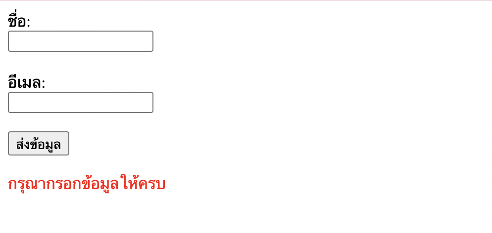
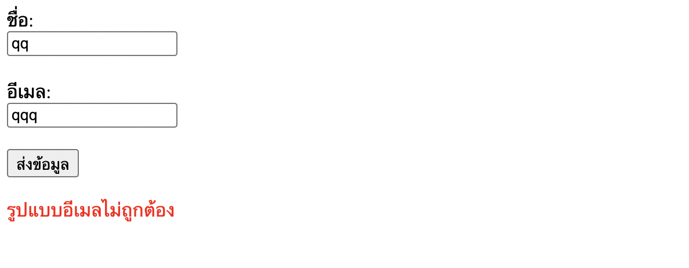

# 5.JavaScript และ DOM Manipulation

## เขียนโค้ด JavaScript ที่อ่านค่าจากฟอร์มที่มี input field สำหรับ ชื่อ และอีเมล จากนั้น validate ข้อมูล ตรวจสอบว่าไม่เว้นว่าง, อีเมล format ถูกต้อง และแสดงข้อความ error หรือ success ( ห้ำมใช้ alert() ) พร้อมอธิบายโค้ดโดยเขียน comment

`HTML`

```
<!doctype html>
<html lang="en">
  <head>
    <meta charset="UTF-8" />
    <meta name="viewport" content="width=device-width, initial-scale=1.0" />
    <title>Document</title>
  </head>
  <body>
    <form id="myForm">
      <label>ชื่อ:</label><br />
      <input type="text" id="name" /><br /><br />

      <label>อีเมล:</label><br />
      <input type="text" id="email" /><br /><br />

      <button type="submit">ส่งข้อมูล</button>

      <!-- แสดงข้อความ -->
      <p id="message"></p>
    </form>
    <script src="script.js"></script>
  </body>
</html>

```

JavaScript

```
// ดึง element จาก DOM
const form = document.getElementById("myForm");
const nameInput = document.getElementById("name");
const emailInput = document.getElementById("email");
const message = document.getElementById("message");

// เมื่อมีการ submit form
form.addEventListener("submit", function (e) {
  e.preventDefault(); // ❗ ป้องกันไม่ให้ form รีเฟรชหน้า

  // เก็บค่าที่ผู้ใช้กรอก
  const name = nameInput.value.trim();
  const email = emailInput.value.trim();

  // สร้าง regex (คือการตรวจสอบว่า email ที่กรอก รูปแบบที่ถูกต้องหรือไม่) สำหรับตรวจสอบ email format
  const emailPattern = /^[^\s@]+@[^\s@]+\.[^\s@]+$/;

  if (name === "" || email === "") {
    // ถ้ามีช่องว่าง
    message.textContent = "กรุณากรอกข้อมูลให้ครบ";
    message.style.color = "red";
    return;
  }

  if (!emailPattern.test(email)) {
    // ถ้า email format ไม่ถูกต้อง
    message.textContent = "รูปแบบอีเมลไม่ถูกต้อง";
    message.style.color = "red";
    return;
  }

  // ถ้าผ่านทุกเงื่อนไข
  message.textContent = "ส่งข้อมูลสำเร็จ!";
  message.style.color = "green";

  // เคลียร์ฟอร์ม
  form.reset();
});
```




