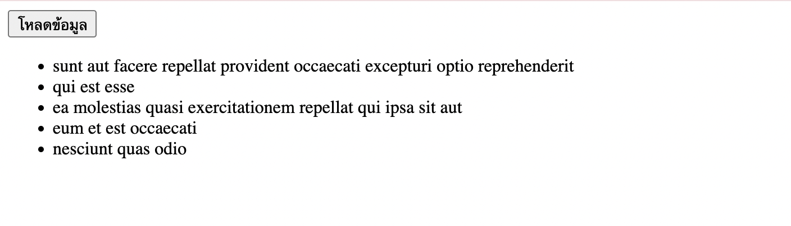

## ข้อที่ 6 Async/Await และ Fetch API

## เขียนฟังก์ชัน async ที่ใช้ Fetch API เพื่อดึงข้อมูลจาก public API (เช่น JSONPlaceholder) โดยต้องมี error handling (try-catch) และแสดง loading state ขณะรอข้อมูล และอธิบายว่าAsync/Await มีข้อดีอะไรเมื่อเทียบกับ Promise .then()

**ตอบ**

`HTML`

```
<button id="loadBtn">โหลดข้อมูล</button>

<p id="loading"></p>
<ul id="dataList"></ul>
<p id="error"></p>
```

`CSS`

```
#loading {
font-size: 20px;
color: black;
}

#error {
color: black;
}
```

`JavaScript`

```
// ฟังก์ชัน async สำหรับดึงข้อมูลจาก API
async function getPosts() {
  const loading = document.getElementById("loading");
  const result = document.getElementById("result");
  const error = document.getElementById("error");

  // 🔹 แสดงสถานะกำลังโหลด
  loading.textContent = "Loading...";
  result.innerHTML = "";
  error.textContent = "";

  try {
    // 🔹 เรียก API จาก jsonplaceholder
    const response = await fetch("https://jsonplaceholder.typicode.com/posts");

    // 🔹 ตรวจสอบว่า response สำเร็จไหม
    if (!response.ok) {
      throw new Error("ไม่สามารถดึงข้อมูลได้");
    }

    // 🔹 แปลงข้อมูลเป็น JSON
    const data = await response.json();

    // 🔹 แสดงข้อมูล (เอา 5 รายการแรก)
    data.slice(0, 5).forEach(post => {
      const p = document.createElement("p");
      p.textContent = post.title;
      result.appendChild(p);
    });

    // 🔹 ลบข้อความ loading
    loading.textContent = "";

  } catch (err) {
    // 🔹 ถ้าเกิด error
    loading.textContent = "";
    error.textContent = err.message;
    error.style.color = "red";
  }
}
```



ข้อดีของ Async/Await เมื่อเทียบกับ Promise .then()

1. อ่านง่ายกว่า (Readable)

- เขียนโค้ดเหมือน synchronous (โค้ดปกติ)

- เข้าใจ flow ได้ง่ายกว่า `.then()` ที่ต้องต่อกันหลายชั้น

2. ลดการซ้อน

- `.then()` หลายๆชั้น -> โค้ดจะซ้อนและอ่านยากกว่า

- `async/await` -> เขียนเรียงบรรทัดตรงๆ

3. จัดการ error ง่ายกว่า

- ใช้ `try...catch ได้เหมือนโค้ดปกติ`

4. Debug ง่ายกว่า

- code เรียงตามลำดับ -> debug ง่าย

- ไม่ต้องไล่หลาย `.then()`
